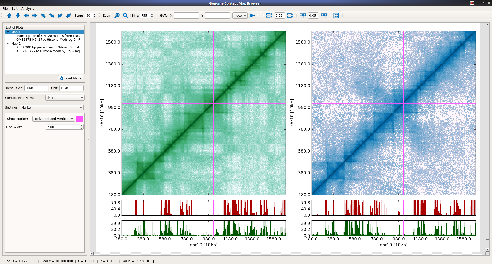
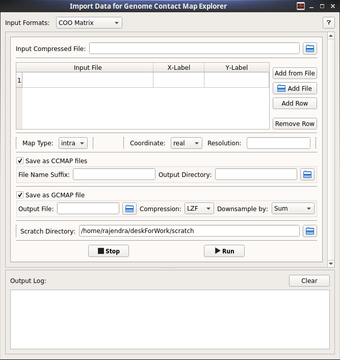
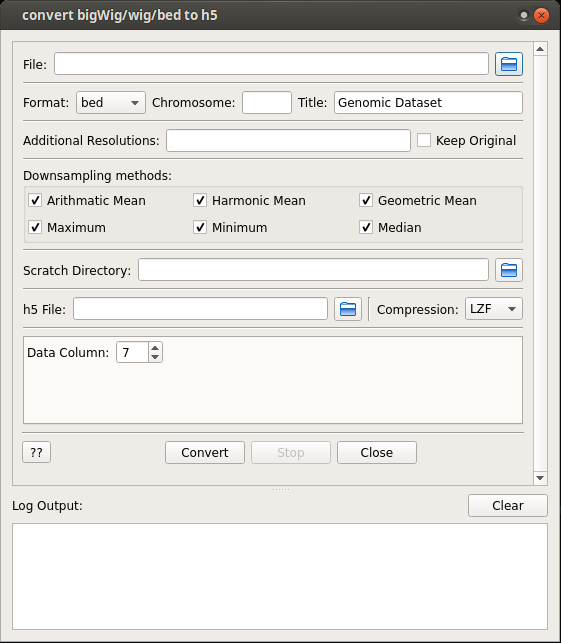
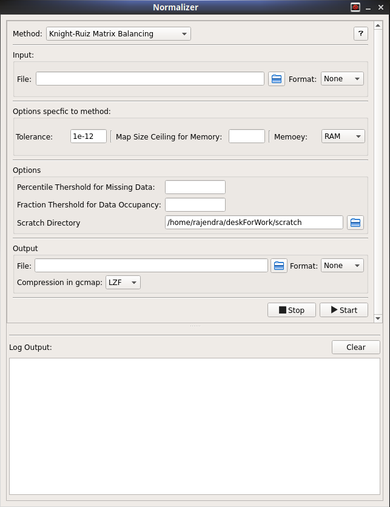

.. hiCMapAnalyze documentation master file, created by
   sphinx-quickstart on Wed Sep 30 22:10:12 2015.
   You can adapt this file completely to your liking, but it should at least
   contain the root `toctree` directive.

Genome Contact Map Explorer - gcMapExplorer
-------------------------------------------

It is a platform to visualize and analyze the contact maps that are generated from Hi-C experiments. This package is developed by considering the huge size of contact maps at very fine resolution. It contains

* :ref:`gui-table` - Several windows like applications to perform tasks.
* Command Line Interface - Several commands to perform tasks.
    * :ref:`import-hic-command-table`
    * :ref:`convert-to-h5-file-table`
    * :ref:`normalize-maps-table`
* `Application Programming Interface <http://gcmapexplorer.readthedocs.io/en/latest/apidoc/summary.html>`_
  - It can be used to perform analysis by any mathematical operations through programming.

**For Discussion and Questions, visit** `this forum <https://groups.google.com/forum/#!forum/gcmapexplorer>`_

Features
--------

* Support for **huge contact maps** - Use of Disk instead of RAM - Matrices/arrays are stored in Disks -
  mathematical operations by directly reading/writing from/to Disks, **without loading them into RAM**
* A `browser <http://gcmapexplorer.readthedocs.io/en/latest/mapBrowser.html>`_ with rich interfaces
  for **Comparative** and **Interactive** visualization of **two dimensional contact maps** along
  with **genomic datasets** such as produced by DNase-seq, ChIP-seq, RNA-seq etc.
* Contact maps can be **zoomed in/out** from finest resolution to whole chromosome level.
* Rich customizations of **color scale for contact maps** visualization
* Rich customizations of **X- and Y- axis properties**.

* `Normalization of contact maps <http://gcmapexplorer.readthedocs.io/en/latest/cmapNormalization.html>`_ by
    * **Iterative Correction** (IC)
    * **Knight-Ruiz Matrix Balancing** (KR)
    * **Distance-Frequency**

* A **new file format** based on HDF5 for `genome contact map <http://gcmapexplorer.readthedocs.io/en/latest/about_gcmap_file.html>`_
  and `genomic track datasets <http://gcmapexplorer.readthedocs.io/en/latest/about_h5_file.html>`_.

    * **Portable**, **platform independent** and can be read through C/C++, JAVA, Python and R programming language.
    * **Very fast to read** - fast browsing of contact maps and genomic datasets

* Another file format for `chormosomal contact map <http://gcmapexplorer.readthedocs.io/en/latest/about_ccmap_file.html>`_
  - much faster than above format to read/write but not compact. Suitable for performing calculations.
* `A GUI interface and commands <http://gcmapexplorer.readthedocs.io/en/latest/about_gcmap_file.html#convert-hi-c-data-to-gcmap>`_
  to convert Coordinate Sparse, Pair Coordinate Sparse, HOMER Interaction matrix, Bin-Contact formats into the new gcmap and ccmap formats.
* `Interface and commands to convert bigWig/wig/bed file to genomic track dataset h5 file
  <http://gcmapexplorer.readthedocs.io/en/latest/about_h5_file.html#convert-bigwig-wig-bed-to-genomic-track-h5-file>`_.
* `Interface and commands for contact map Normalizations <http://gcmapexplorer.readthedocs.io/en/latest/cmapNormalization.html>`_.
* Publication ready images at one click.

Screen-shots
------------

      Genome Contact Map browser

.. figure:: images/axis.png
      :scale: 35%
      :alt: Screen snapshot of Axis Properties interface in Browser

      Axis Properties interface in Browser

      gcmap Importer Interface

      genomic track dataset converter Interface

      Contact map normalization Interface

****

Contents
========

.. py:module:: gcMapExplorer

.. toctree::
   :maxdepth: 2

   Requirements and Installation <install>
   How to use gcMapExplorer? <usage.rst>
   Genome Contact Map Browser <mapBrowser.rst>
   About gcmap file <about_gcmap_file>
   About ccmap and npbin files <about_ccmap_file>
   About Genomic track h5 file <about_h5_file>
   Normalization of Hi-C maps <cmapNormalization>
   Frequently asked questions <faq.rst>
   Download example datasets <dLcmaps>
   Summary of Python Modules <apidoc/summary>
   Examples using Python Modules <modules_examples/index>
   Python Modules documentation <apidoc/index>

Indices
=======

* :ref:`genindex`
* :ref:`modindex`
