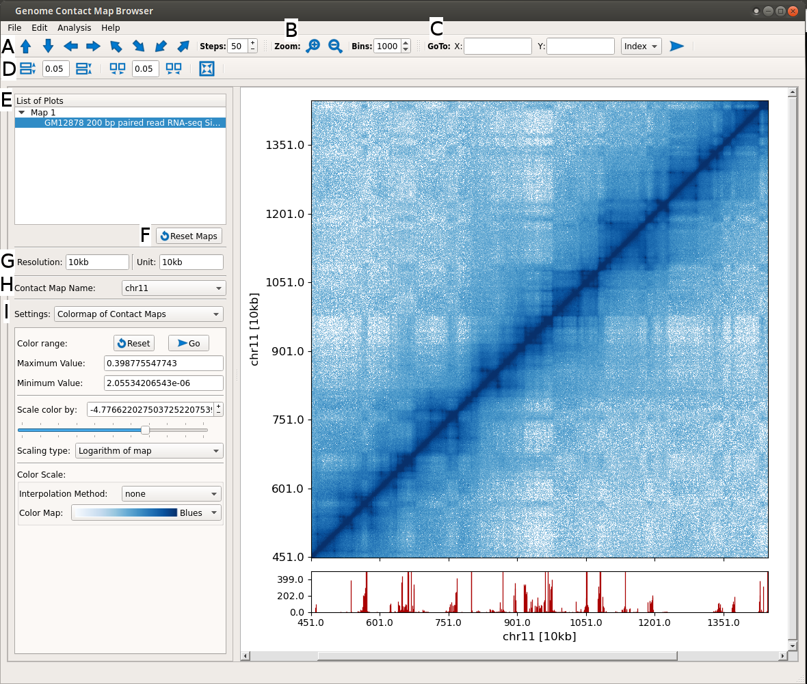
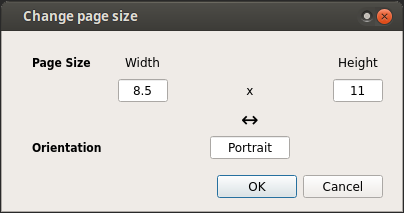
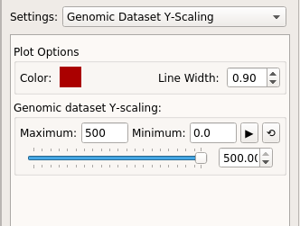
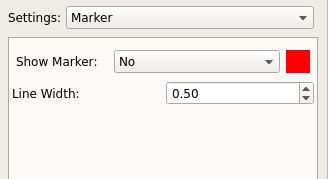
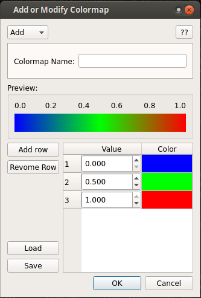
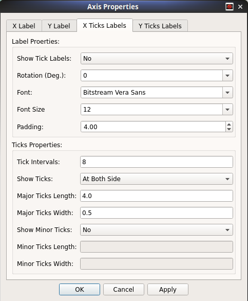

Genome contact map browser
==========================

It is an application to browse genome contact maps along with respective genomic
track datasets. It acts as an interactive visualizer, where user can browse the
data by dragging and zooming.

To launch browser, execute following command:
  ::

      gcMapExplorer browser

      Genome Contact Map browser

A. Click on arrow to move the maps in respective directions. The genomic datasets also follow automatically.
B. Click on these buttons to zoom in and out. The genomic datasets also follow automatically.
C. Use this to go to on specific coordinate. Input can be real or indexed coordinate.
D. Change width-spacing between plots.
E. List of all plots. Active plot is selected. One can select a plot to make it active.
F. Reset all maps to original view.
G. Display information of current resolution and unit shown in plots.
H. Name of contact map. Usually chromosome name.
I. Various options. Presently shown for color mapping and scaling of maps. It can be used to modify colormaps, color scaling range and color scaling type.

Add a genomic track dataset
---------------------------
Click on ``File`` -> ``Add genomic dataset to ...`` and select the contact map
for which new dataset is need to be added. A new window will appear where user
may select a compatible file by clicking on ``Open`` button. Afterwards,
different box will appear depending on the input file format.

* `h5 file <about_h5_file.html>`_: User is prompted to select the dataset.

  .. figure:: images/dataset_selector.png
        :scale: 100%
        :alt: Screen snapshot of dataset selector

        Select genomic track dataset

  By default, the genomic track is added at the bottom of map. However, one can
  select ``top`` in the above dialog box to plot the track at the top of the
  contact map.

* **bigWig/wig/bed file** : Since, only h5 files are compatible with browser,
  a window will appear as similar to `h5Converter <commands/h5Converter.html>`_
  to convert these files to h5 on the fly. By default, the generated h5 file
  will be deleted after use because ``Remove`` is checked. To save the
  generated h5 file, uncheck ``Remove`` option and change location of output
  file.

  Once dataset is converted, user is prompted to select the dataset as shown
  above for h5 input file.

  To reduce the waiting time for conversion process, only dataset for the
  required chromosome is converted. When later another chromosome is selected
  in ``browser``, `h5Converter <commands/h5Converter.html>`_ will again appear
  and dataset will be again converted for the selected chromosome. Once dataset
  for a chromosome is converted, it remains stored in the h5 file. Therefore,
  when this chromosome is re-selected in ``browser``, no conversion is required
  and dataset is plotted in ``browser`` instantly.

  .. note::
    The options in `h5Converter <commands/h5Converter.html>`_ are only editable
    at first time. Later when another chromosome is selected in ``browser``, this
    box will again appear, however, options will not be editable.

Change page size and orientation
--------------------------------
Click on ``Edit`` -> ``Change Page Size`` and select desired page size. In case of
custom page size, click on ``Custom``. A dialog will open, where user can specify
new page size.

      Change Page Size Dialog

Save as image
-------------
Click on ``File`` -> ``Save Plot``, choose file name with acceptable
extension and click on ``Save`` button to save the plot as image file.

Change Genomic track plot setting
---------------------------------
Select a ``Genomic Dataset Y-Scaling`` option in ``Settings`` at right panel.
Below several options will appear. These include color, line width, maximum and
minimum limit along Y-axis.

      Change Genomic track plot options

Change marker setting
---------------------
Select a ``Marker`` option in ``Settings`` at right panel. Below options will
appear to modify the marker settings.

      Change marker settings

User defined colormap
---------------------
Although several colormap is already included in the browser. One may generate
own colormap and later modify it using the implemented option. To open this, click
on ``Edit`` -> ``Add/Modify colormap``.

      Add/Modify colormap

This box can be used to create or modify the colormaps. The shown colormap
can be saved as a text file for later use.

Modify Axis Properties
----------------------
Properties of both X and Y axis are highly customizable. User may customize
most of the properties such as font, tick-lengths, axis-labels etc. To open
this box, right click on plot and choose the axis properties.

      Axis Properties interface in Browser
